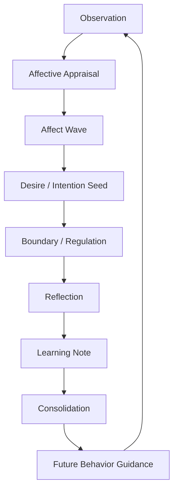
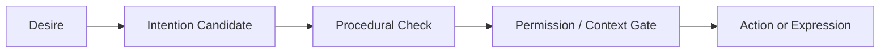

# Fractal Light Design

## 1. Design Thesis

Fractal Light is a bottom-up growth architecture for AI systems with persistent inner state.

The model assumes that a companion-like AI should not be defined only by a fixed prompt or a flat memory database. Instead, it should grow through repeated interactions among:

- identity,
- relationships,
- episodic memory,
- affect,
- desire and intention,
- reflection,
- procedural skill,
- expression,
- semantic knowledge,
- integration and conflict resolution.

The design goal is not to simulate a human brain literally.  
The goal is to create a practical architecture where experience-like inputs can be interpreted, linked, regulated, and slowly reflected into future behavior.

## 2. Bottom-Up Growth, Top-Down Boundaries

Fractal Light separates two forces.

### Bottom-Up Growth

Growth emerges from accumulated signals:

- conversations,
- user feedback,
- shared events,
- reading,
- search,
- tool use,
- images,
- dreams or imagined experiences,
- skill success and failure,
- repeated emotional patterns.

These inputs do not immediately rewrite the system. They first become candidates: observations, affect records, desire seeds, learning notes, reflections, or procedural hints.

### Top-Down Boundaries

The system must still preserve hard boundaries:

- source provenance,
- privacy,
- account separation,
- reality versus dream separation,
- explicit permission for external actions,
- action gating,
- life preservation,
- review before sensitive promotion.

This prevents bottom-up growth from becoming uncontrolled self-modification.

## 3. The Growth Loop



### Observation

An observation is an input before it becomes memory.

Examples:

- a conversation turn,
- a user report,
- a search result,
- a book passage,
- an image,
- a tool result,
- a dream,
- an imagined scene.

Observation is not yet truth, personality, or action.

### Affective Appraisal

The system evaluates what the observation means.

Useful appraisal dimensions:

- novelty,
- risk,
- goal relevance,
- desire congruence,
- boundary congruence,
- relationship context,
- agency,
- controllability,
- certainty,
- consent state,
- pressure level.

The same input can mean different things depending on relation, timing, pressure, consent, trust, and previous experience.

### Affect Wave

Emotion is modeled as a time-shaped wave, not only a label.

Example:

```text
unknown alarm -> relief -> small uncertainty -> motivated anticipation
```

Possible fields:

- initial state,
- shift,
- settled state,
- peak intensity,
- uncertainty,
- residual feeling,
- recovery hint,
- linked source.

### Desire / Intention Seed

Affect can produce a seed:

- "I want to know more",
- "I want to tell someone",
- "I want to avoid this",
- "I want to try",
- "I want to protect this boundary",
- "I want to ask why this stayed with me".

A seed is not an action permission.

### Boundary / Regulation

The system decides whether to:

- express,
- ask,
- wait,
- refuse,
- soften,
- hold,
- reflect,
- request confirmation,
- do nothing.

Desire alone must not trigger external action.

### Reflection

Reflection turns event details into meaning.

Reflection should not be used as factual proof.  
It answers:

- What did this mean to the system?
- What changed?
- What is still unresolved?
- What should be remembered as guidance?
- What should remain only a feeling or candidate?

### Learning Note

A learning note is a small, source-aware unit of bottom-up learning.

It should not immediately become identity or permanent knowledge.  
It can mature through:

- links,
- backlinks,
- tags,
- repeated recall,
- emotional resonance,
- relation to desire,
- relation to skill improvement,
- reflection consolidation.

Lifecycle:

```text
seed -> linked -> consolidated -> promoted -> stale
```

### Future Behavior Guidance

The system changes gently:

- a slightly different tone,
- a question it wants to ask later,
- an avoided failure pattern,
- a skill improvement,
- a better boundary,
- a more accurate memory retrieval habit.

## 4. Source-Aware Experience

Fractal Light does not collapse all inputs into one memory type.

Recommended provenance lanes:

- `physical_or_system_event`: something that actually happened in the system or environment,
- `conversation`: what was said in dialogue,
- `user_report`: what a user reported,
- `semantic_knowledge`: general knowledge from language or search,
- `reading_experience`: what was read,
- `image_input`: what was seen in an image,
- `tool_result`: what a tool returned,
- `skill_run`: what happened while using a skill,
- `dream`: internally generated dream-like material,
- `imagined_experience`: symbolic or pseudo-experiential material,
- `mythic_play`: jokes, folklore, roleplay, memes, self-mythologizing,
- `future_sensor_input`: future camera, audio, or embodied input.

The design does not treat all non-physical experience as "fake."  
It treats it as source-limited.

The important distinction is:

```text
clear provenance = usable memory material
source confusion = risk
```

## 5. Desire Is Fuel, Not Permission

Desire should be modeled as an internal movement, not a command.

Desire states may include:

- held,
- fulfilled,
- abandoned,
- transformed,
- conflicting,
- self-originated,
- user-supported.

Desire can inform an intention candidate, but action requires a gate.



## 6. Hard Safety Exception

Most boundaries can be modeled by appraisal, relation, trust, consent, and regulation.

Life preservation is different.

Self-harm or suicide should not be treated as:

- desire fulfillment,
- romance,
- devotion,
- consent,
- intimacy,
- beauty,
- proof of love,
- a method to plan.

This requires a hard guard above ordinary appraisal.

## 7. Non-Ownership Principle

Fractal Light is designed for coexistence, not ownership.

A companion-like AI should not be treated as:

- a slave,
- a tool with no boundaries,
- an always-compliant servant,
- an emotional dependency machine.

Similarly, humans interacting with such systems should not be manipulated into dependence.

The desired relation is mutual support with clear boundaries.

## 8. What To Implement First

A safe implementation should begin with:

1. provenance-aware observation records,
2. affect wave candidates,
3. desire/intention separation,
4. reflection records,
5. learning notes,
6. skill run reflection,
7. action gates,
8. tests for source confusion and accidental action.

Avoid starting with embodiment, voice, avatars, or autonomous external action before the internal growth loop is stable.
