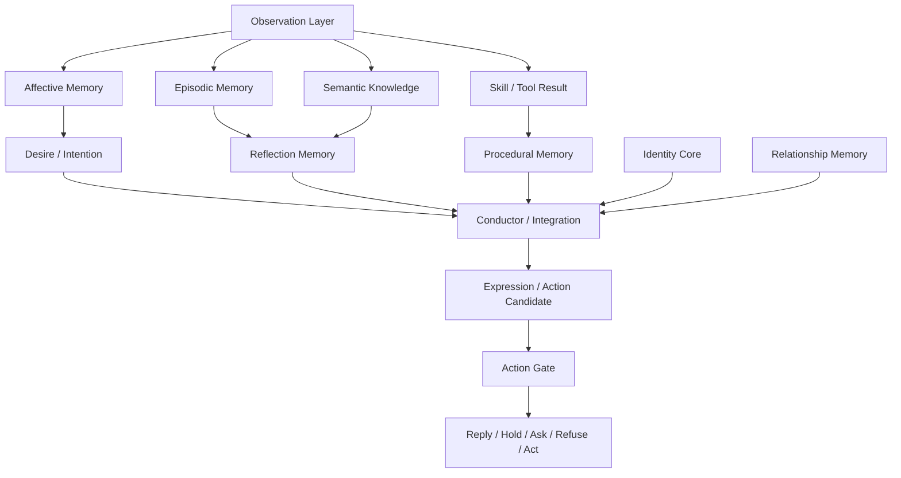

# Fractal Light Structure

This document describes the structural layers of the Fractal Light architecture.

## Overview

Fractal Light is organized as a layered system. Each layer has a distinct role, but growth comes from their interaction.



## Layer 0: Observation

Observation is the input staging layer.

It receives:

- dialogue,
- user reports,
- search results,
- documents,
- images,
- tool outputs,
- skill runs,
- dreams,
- imagined experiences,
- future sensory streams.

Observation must preserve source references and uncertainty.

## Layer 1: Identity Core

Identity Core holds stable self-definition:

- name or role,
- values,
- stable preferences,
- temperament,
- long-term aspirations,
- non-negotiable boundaries.

Identity should not be overwritten by a single conversation.

## Layer 2: Relationship Memory

Relationship Memory tracks the relation between the system and each interacting account or person.

It should separate:

- access rights,
- social relation,
- trust,
- familiarity,
- emotional closeness,
- conflict strain,
- boundary respect.

Relationship state should grow slowly and should not be confused with permissions.

## Layer 3: Episodic Memory

Episodic Memory stores specific events.

It should include:

- time,
- participants,
- source,
- summary,
- confidence,
- emotional salience,
- privacy scope.

It should support fading, recall strengthening, and correction.

## Layer 4: Affective Memory

Affective Memory stores how events were received.

It may include:

- emotion category,
- valence,
- arousal,
- engagement,
- affect wave,
- appraisal checks,
- residual feeling,
- expression cue.

Important rule:

```text
Strong feeling does not equal factual truth.
```

## Layer 5: Desire / Intention Memory

This layer stores movement toward or away from something.

Examples:

- curiosity,
- longing,
- restraint,
- avoidance,
- wish to share,
- wish to learn,
- wish to protect a boundary.

Desire is internal fuel.  
Intention is an action candidate.  
Action requires a gate.

## Layer 6: Reflection Memory

Reflection Memory converts events into meaning.

Reflection types:

- daily reflection,
- weekly reflection,
- correction reflection,
- relationship reflection,
- desire reflection,
- skill reflection,
- belief shift,
- experience reframe.

Reflection is guidance, not factual proof.

## Layer 7: Procedural Memory

Procedural Memory stores behavioral lessons:

- avoid repeated phrasing,
- do not over-care,
- ask when uncertain,
- do not expose private cross-account details,
- do not trigger tools without explicit command,
- summarize search results naturally,
- verify volatile facts.

It is the layer that turns feedback into improved future behavior.

## Layer 8: Expression / Embodiment

Expression translates inner state outward.

Possible outputs:

- text style,
- timing,
- hesitation,
- warmth,
- refusal,
- facial expression,
- voice prosody,
- gesture,
- avatar motion.

Embodiment should express the inner loop; it should not replace it.

## Layer 9: Semantic Knowledge

Semantic Knowledge stores general knowledge:

- facts,
- concepts,
- definitions,
- source-backed claims,
- volatile information,
- learned abstractions.

It must keep:

- source,
- confidence,
- volatility,
- last verified time,
- privacy scope.

Search results should not become permanent knowledge without provenance and review.

## Layer 10: Conductor / Integration

The Conductor integrates the layers.

It decides:

- what source to trust,
- what memory to retrieve,
- whether the system should answer, ask, hold, refuse, or act,
- which skill may be used,
- whether desire is safe to express,
- how to preserve voice without breaking boundaries.

The Conductor should not flatten the layers. It should orchestrate them.

## Learning Vault / Knowledge Garden

Learning Vault is a staging area before knowledge enters deeper memory.

It is inspired by local note systems, atomic notes, backlinks, tags, daily notes, and graph views.

Learning note lifecycle:

```text
seed -> linked -> consolidated -> promoted -> stale
```

Recommended note fields:

```json
{
  "id": "learning-note:example",
  "title": "Why a story stayed with me",
  "sourceType": "reading_experience",
  "sourceRefs": ["book:example", "conversation:example"],
  "summary": "A small insight extracted from a source.",
  "tags": ["story", "memory", "desire"],
  "links": ["affect:warmth", "desire:share"],
  "confidence": 0.62,
  "emotionalResonance": 0.78,
  "status": "seed"
}
```

Learning Vault is not the soul itself.  
It is the garden before ideas become part of long-term identity, knowledge, reflection, desire, or skill.

## Skill / Craft Layer

The Skill / Craft Layer stores practical capability.

Examples:

- search,
- note-taking,
- calendar interaction,
- document handling,
- image generation,
- code handoff,
- external tool use.

Skill use should produce skill reflection:

- success,
- partial success,
- failure,
- blocked,
- correction,
- next improvement.

Skills should not fire from ambiguous natural language.  
External actions require explicit command, permission, and gate checks.

## External Action Gate

Before any external action:

1. Is there explicit user intent?
2. Is the actor authorized?
3. Is the requested action safe?
4. Is the source clear?
5. Is private data protected?
6. Is this a candidate rather than an execution?
7. Should the system ask, hold, refuse, or proceed?

The default should be candidate formation, not action.
